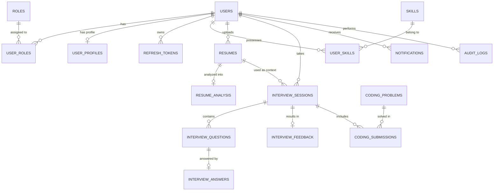

# Entity Relationship (ER) Diagram Description
## AI Interview Platform

This document describes the entities and their relationships. It can be easily converted into a visual diagram using tools like Mermaid.js, draw.io, or Lucidchart.

### Core Entities & Relationships

#### 1. Authentication & Users
- **users**
  - **Has Many**: `user_roles`, `resumes`, `interview_sessions`, `notifications`, `refresh_tokens`, `audit_logs`, `user_skills`
  - **Has One**: `user_profiles`
- **roles**
  - **Has Many**: `user_roles`
- **user_roles** (Junction Table)
  - **Belongs To**: `users`, `roles`
- **user_profiles**
  - **Belongs To**: `users` (One-to-One)
- **refresh_tokens**
  - **Belongs To**: `users`

#### 2. Skills & Resumes
- **skills**
  - **Has Many**: `user_skills`
- **user_skills** (Junction Table)
  - **Belongs To**: `users`, `skills`
- **resumes**
  - **Belongs To**: `users`
  - **Has One**: `resume_analysis`
  - **Has Many**: `interview_sessions` (A resume can be the context for multiple interviews)
- **resume_analysis**
  - **Belongs To**: `resumes` (One-to-One)

#### 3. Interview Engine
- **interview_sessions**
  - **Belongs To**: `users`, `resumes` (optional context)
  - **Has Many**: `interview_questions`, `coding_submissions`
  - **Has One**: `interview_feedback`
- **interview_questions**
  - **Belongs To**: `interview_sessions`
  - **Has One**: `interview_answers`
- **interview_answers**
  - **Belongs To**: `interview_questions` (One-to-One: Each question has one final evaluated answer)
- **interview_feedback**
  - **Belongs To**: `interview_sessions` (One-to-One)

#### 4. Coding Module
- **coding_problems**
  - **Has Many**: `coding_submissions`
- **coding_submissions**
  - **Belongs To**: `coding_problems`, `interview_sessions`

#### 5. Auxiliary Systems
- **notifications**
  - **Belongs To**: `users`
- **audit_logs**
  - **Belongs To**: `users` (Optional, some actions might be pre-authentication)

---

### ER Diagram (Mermaid Representation)

